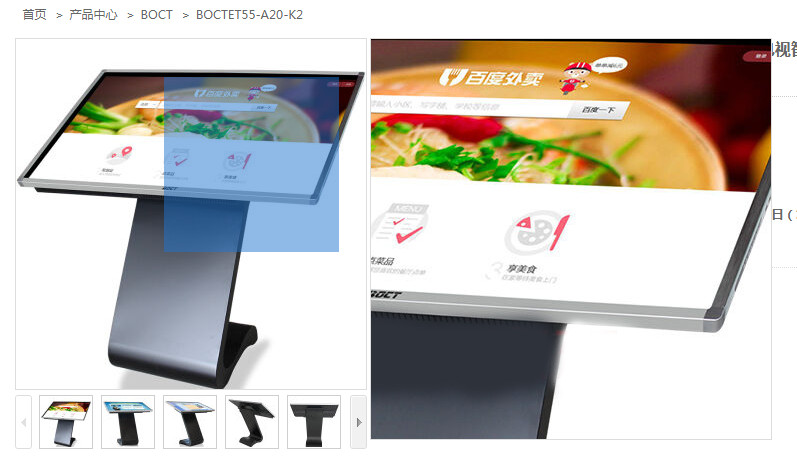
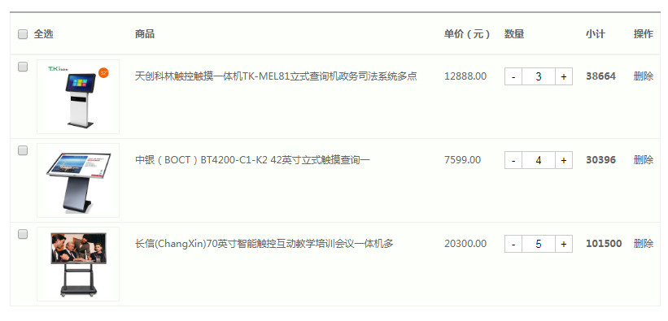

## 触摸一体机网上商城

## 软件截图：

## 使用步骤：
* git clone项目到本地
* 在网上下载XAMPP Control Panel，并开启web和mysql服务器
* 将整个项目移动到xampp\htdocs文件下
* 在 http://localhost/phpmyadmin/ 中导入项目文件夹中的productlist__shoppingcar/app_tcim.sql到数据库中
* 访问 http://localhost/TP-E-Shop 即可打开商城首页

## 可用页面：
* 首页
* 产品中心
* 产品中心->详情页
* 登录/注册
* 去购物车结算

## 功能点：
* 用户登录注册
* 产品详情页放大镜的实现
* 购物车功能
* 分页功能
* H5新功能:表单新特性、video、sessionstorage
* ajax+php+mysql

## 说明：
Demo用于学习交流, 转载请注明出处!

